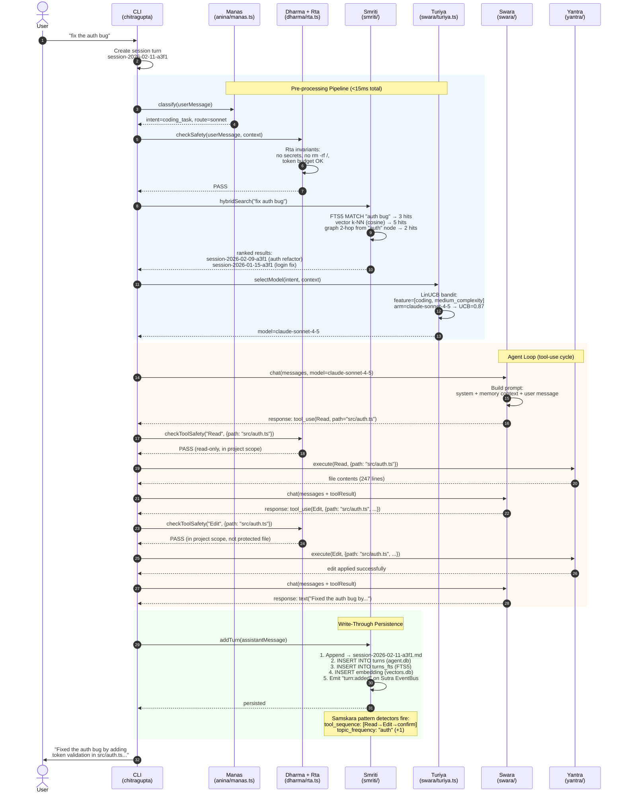
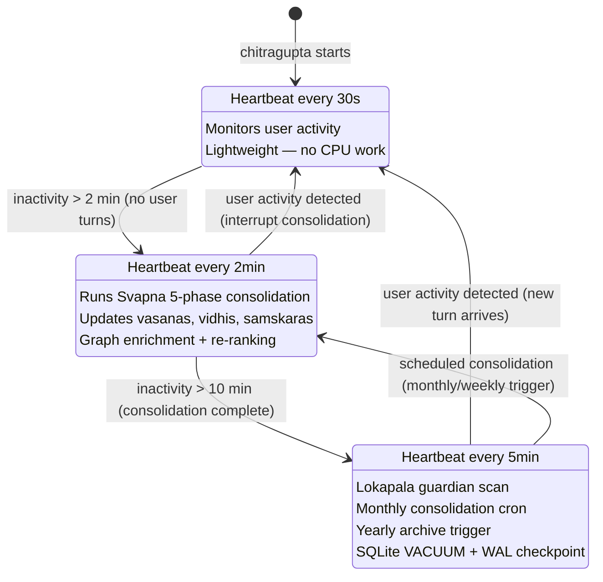
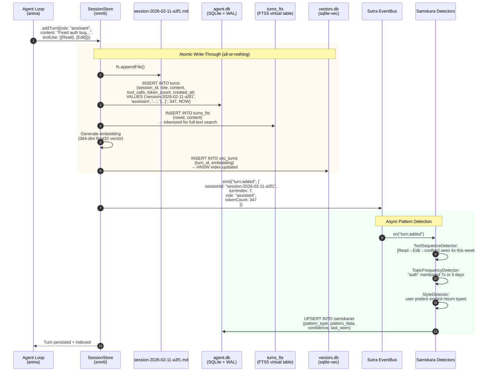

# CHITRAGUPTA — Architecture Guide

> Practical engineering reference for the 14-package monorepo.
> For algorithms & math, see [ALGORITHMS.md](./ALGORITHMS.md).
> For the Vedic cognitive models, see [VEDIC-MODELS.md](./VEDIC-MODELS.md).

---

## Package Dependency Graph

```
                         ┌──────────┐
                         │   cli    │  ← entry point (binary: chitragupta)
                         └────┬─────┘
                              │
           ┌──────────────────┼──────────────────┐
           │                  │                  │
      ┌────┴────┐       ┌────┴────┐       ┌─────┴────┐
      │  anina  │       │   ui    │       │  tantra  │
      │ (agent) │       │ (render)│       │ (MCP srv)│
      └────┬────┘       └─────────┘       └────┬─────┘
           │                                    │
    ┌──────┼──────┬──────────┬──────────────────┘
    │      │      │          │
┌───┴──┐┌──┴──┐┌──┴───┐┌────┴────┐
│smriti││swara││dharma ││  vayu   │
│(mem) ││(LLM)││(rules)││ (DAG)  │
└──┬───┘└──┬──┘└───────┘└────┬───┘
   │       │                  │
   │  ┌────┴────┐      ┌─────┴─────┐
   │  │ niyanta │      │vidhya-skl │
   │  │(strategy│      │ (skills)  │
   │  └─────────┘      └───────────┘
   │
   ├── sutra (pub/sub, mesh)
   ├── netra (telemetry)
   └── yantra (tools)

   ┌──────┐
   │ core │  ← shared types, events, errors (depended on by ALL)
   └──────┘
```

### Package Responsibilities

| Package | Sanskrit | Role | Key Exports |
|---------|----------|------|-------------|
| **core** | — | Shared types, events, errors | `ChitraguptaSettings`, `EventBus`, `ChitraguptaError` |
| **swara** | Voice | LLM provider abstraction | `ProviderRegistry`, `chat()`, `stream()` |
| **anina** | Breath | Agent loop, ChetanaController | `Agent`, `ChetanaController`, context compaction |
| **smriti** | Memory | Sessions, search, graph, vectors | `SessionStore`, `search()`, `recall()`, `GraphRAG` |
| **yantra** | Machine | Tool implementations | `bashTool`, `readTool`, `writeTool`, etc. |
| **dharma** | Law | Safety rules, audit | `RuleEngine`, `audit()` |
| **niyanta** | Governor | Strategy selection (UCB1/LinUCB) | `StrategyBandit`, `ThompsonSampling` |
| **sutra** | Thread | Pub/sub, P2P mesh, gossip | `EventBus`, `Mesh`, `Mailbox` |
| **vayu** | Wind | DAG workflow engine | `DAG`, `Pipeline`, `schedule()` |
| **tantra** | Loom | MCP server integration | `MCPServer`, tool/prompt/resource registration |
| **netra** | Eye | Telemetry, observability | `Tracer`, `MetricsCollector` |
| **vidhya-skills** | Knowledge | Pluggable skill system | `VidyaOrchestrator`, `SkillRegistry` |
| **ui** | — | Terminal rendering | `render()`, ANSI helpers, components |
| **cli** | — | CLI entry, commands, HTTP server | `chitragupta` binary, REST API |

---

## Data Flow

### 1. Request Path (User → Response)

```
User Input
    │
    ▼
┌─────────────────────────────────┐
│ Manas Pre-Processor             │  ← regex intent + keyword extract (<5ms)
│ (packages/anina/src/manas.ts)   │     route: no-LLM | haiku | sonnet | opus
└─────────┬───────────────────────┘
          │
          ▼
┌─────────────────────────────────┐
│ Dharma + Rta Check              │  ← safety invariants
│ (packages/dharma/)              │
└─────────┬───────────────────────┘
          │
          ▼
┌─────────────────────────────────┐
│ Smriti Retrieval                │  ← hybrid search: FTS5 + vectors + graph
│ (packages/smriti/)              │     L1 cache → SQLite → Qdrant
└─────────┬───────────────────────┘
          │
          ▼
┌─────────────────────────────────┐
│ Turiya Model Router             │  ← LinUCB picks model tier
│ (packages/swara/src/turiya.ts)  │
└─────────┬───────────────────────┘
          │
          ▼
┌─────────────────────────────────┐
│ Swara LLM Call                  │  ← stream/chat with selected model
│ (packages/swara/)               │
└─────────┬───────────────────────┘
          │
          ▼
┌─────────────────────────────────┐
│ Yantra Tool Execution           │  ← if tool_use in response
│ (packages/yantra/)              │     loop back to Dharma check
└─────────┬───────────────────────┘
          │
          ▼
┌─────────────────────────────────┐
│ Smriti Write-Through            │  ← append to session.md + SQLite index
│ (packages/smriti/)              │     + Samskara pattern detection
└─────────────────────────────────┘
```

### 2. Write Path (Session Persistence)

```
addTurn(turn)
    │
    ├──► Append to session-YYYY-MM-DD.md  (human-readable source of truth)
    │
    ├──► INSERT INTO turns (SQLite agent.db)
    │
    ├──► INSERT INTO turns_fts (FTS5 index)
    │
    ├──► INSERT embedding into vectors.db (sqlite-vec)
    │
    └──► Emit "turn:added" on Sutra EventBus
              │
              └──► Samskara pattern detectors listen
```

### 3. Consolidation Path (Background)

```
┌─────────────────────────────────────────────────┐
│  Nidra Daemon (always running)                  │
│                                                 │
│  LISTENING ──► DREAMING ──► DEEP_SLEEP          │
│  (30s beat)   (2min beat)   (5min beat)         │
│                                                 │
│  DREAMING triggers:                             │
│  ┌─────────────────────────────────────────┐    │
│  │ Svapna 5-Phase Consolidation            │    │
│  │ 1. REPLAY    — re-traverse, surprise    │    │
│  │ 2. RECOMBINE — cross-session patterns   │    │
│  │ 3. CRYSTALLIZE — BOCPD, samskaras→vasana│    │
│  │ 4. PROCEDURALIZE — tool seq → vidhis    │    │
│  │ 5. COMPRESS  — Sinkhorn-Knopp weighted  │    │
│  └─────────────────────────────────────────┘    │
│                                                 │
│  DEEP_SLEEP triggers:                           │
│  ┌─────────────────────────────────────────┐    │
│  │ Monthly Cron  — consolidate → report    │    │
│  │ Yearly Cron   — archive → S3/Qdrant    │    │
│  │ Lokapala Scan — security/perf/correct   │    │
│  └─────────────────────────────────────────┘    │
└─────────────────────────────────────────────────┘
```

---

## Storage Architecture

### Databases (all under `~/.chitragupta/`)

| Database | Engine | Contents | Hot Cache |
|----------|--------|----------|-----------|
| `agent.db` | SQLite + WAL | sessions, turns, turns_fts, consolidation_rules, vasanas, kartavyas | LRU (100 sessions) |
| `graph.db` | SQLite + WAL | nodes, edges, pagerank | Adjacency LRU (1000 nodes) |
| `vectors.db` | SQLite + sqlite-vec | embeddings, HNSW index | None (sqlite-vec is fast) |

### File Layout

```
~/.chitragupta/
├── agent.db                        # Sessions, turns, FTS5, vasanas
├── graph.db                        # Knowledge graph
├── vectors.db                      # Embeddings (sqlite-vec)
├── projects/
│   └── <hash>/
│       ├── sessions/
│       │   └── YYYY/MM/
│       │       └── session-YYYY-MM-DD.md      # Daily session (append-only)
│       ├── consolidated/
│       │   ├── monthly/YYYY-MM.md             # Monthly report
│       │   └── yearly/YYYY.md                 # Yearly report
│       └── memory/
│           ├── identity.md
│           ├── projects.md
│           ├── tasks.md
│           └── flow.md
├── vasanas/                        # Behavioral tendencies (also in agent.db)
├── vidhis/                         # Learned procedures
└── config.json
```

### Three-Tier Data Lifecycle

```
HOT (in-process)          WARM (local SQLite)         COLD (remote)
──────────────────        ──────────────────          ──────────────
L1 LRU cache              agent.db (FTS5)             Qdrant (vectors)
Recent sessions           vectors.db (sqlite-vec)     S3/Azure (archives)
Active graph neighbors    graph.db                    Yearly .tar.gz
────── ms latency ──────  ────── <50ms latency ─────  ── 100-500ms ──

                Daily write-through ──►
                Monthly consolidation ──────────────►
                Yearly archive + VACUUM ────────────►
```

---

## Multi-Project Support

Sessions are scoped by project via `project TEXT NOT NULL` in the sessions table.

### Per-Project
- Session files: `projects/<hash>/sessions/`
- Consolidated reports: `projects/<hash>/consolidated/`
- Memory streams: `projects/<hash>/memory/`
- SQLite queries filtered by `WHERE project = ?`

### Cross-Project (Global)
- Vasanas appearing across 3+ projects are promoted to global vasanas
- Global vasanas stored in `agent.db` with `project = '__global__'`
- User preferences, coding style, general facts are cross-project
- Search priority: current project → global → other projects (only if explicit)

---

## Key Design Decisions

1. **Single new dependency**: `better-sqlite3` (+ `sqlite-vec` extension). No server processes.
2. **Append-only sessions**: `.md` files are human-readable, never rewritten. SQLite is the index, not the source of truth.
3. **Write-through**: Every write goes to both `.md` and SQLite atomically.
4. **WAL mode**: Readers never block writers. Consolidation runs alongside live queries.
5. **No breaking changes**: Existing `.md` sessions are migrated on first run. Old data is preserved.
6. **Turiya routes, not replaces**: Model routing is additive — user can override.
7. **Lokapala are always-on**: Guardian agents run in Nidra DEEP_SLEEP, not on-demand.
8. **Kartavya requires niyama approval**: No auto-execution without user opt-in first.

---

## Performance Targets

| Operation | Target | Approach |
|-----------|--------|----------|
| Session list | <10ms | SQLite indexed query |
| Full-text search | <10ms | FTS5 MATCH + rank |
| Vector k-NN (10K) | <5ms | sqlite-vec HNSW |
| Graph neighbor lookup | <1ms | SQLite + LRU cache |
| Turiya routing | <2ms | LinUCB (no LLM) |
| Manas classification | <5ms | Regex + keywords |
| Triguna update | <1ms | Kalman filter step |
| Pratyabhijna warm-up | <30ms | Top-K vasanas + samskaras |
| Svapna full cycle | <20s | Worker thread |
| Hybrid search (FTS+vec+graph) | <30ms | Parallel + merge |

---

## Interactive Diagrams (Mermaid)

> The ASCII diagrams above are the authoritative quick-reference.
> The Mermaid diagrams below provide richer, interactive versions with concrete examples.

### Example: User Asks "Fix the auth bug" — Full Request Path



### Nidra Sleep Cycle — State Machine



### Svapna 5-Phase Consolidation — Flowchart

```mermaid
flowchart TD
    START([Nidra enters DREAMING]) --> REPLAY

    subgraph Phase1["Phase 1: REPLAY"]
        REPLAY[Re-traverse today's sessions]
        REPLAY --> SURPRISE[Calculate surprise scores<br/>per turn using KL-divergence]
        SURPRISE --> HIGH{Surprise > threshold?}
        HIGH -->|Yes| TAG[Tag as novel pattern<br/>for Phase 2]
        HIGH -->|No| SKIP[Mark as routine]
    end

    TAG --> RECOMBINE_START
    SKIP --> RECOMBINE_START

    subgraph Phase2["Phase 2: RECOMBINE"]
        RECOMBINE_START[Cross-session pattern detection]
        RECOMBINE_START --> CLUSTER[Cluster similar turns<br/>across sessions via embeddings]
        CLUSTER --> BRIDGE[Detect bridging patterns<br/>e.g. auth→testing→deploy]
    end

    BRIDGE --> CRYSTALLIZE_START

    subgraph Phase3["Phase 3: CRYSTALLIZE"]
        CRYSTALLIZE_START[BOCPD change-point detection]
        CRYSTALLIZE_START --> CHANGEPOINT{Change-point<br/>detected?}
        CHANGEPOINT -->|Yes| VASANA[Promote samskara → vasana<br/>e.g. 'prefers explicit types']
        CHANGEPOINT -->|No| KEEP[Keep as samskara<br/>needs more evidence]
        VASANA --> GLOBAL{Seen in 3+<br/>projects?}
        GLOBAL -->|Yes| PROMOTE[Promote to global vasana<br/>project = '__global__']
        GLOBAL -->|No| LOCAL[Keep as project vasana]
    end

    KEEP --> PROC_START
    PROMOTE --> PROC_START
    LOCAL --> PROC_START

    subgraph Phase4["Phase 4: PROCEDURALIZE"]
        PROC_START[Detect repeated tool sequences]
        PROC_START --> SEQMINE[Mine frequent subsequences<br/>e.g. Read→Edit→bash test]
        SEQMINE --> VIDHI{Frequency ≥ 3<br/>in 7 days?}
        VIDHI -->|Yes| CREATE_VIDHI[Create vidhi<br/>learned procedure]
        VIDHI -->|No| WAIT[Accumulate more evidence]
    end

    CREATE_VIDHI --> COMPRESS_START
    WAIT --> COMPRESS_START

    subgraph Phase5["Phase 5: COMPRESS"]
        COMPRESS_START[Sinkhorn-Knopp weighted compression]
        COMPRESS_START --> WEIGHT[Assign importance weights:<br/>high-surprise=1.0, routine=0.3]
        WEIGHT --> SINKHORN[Doubly-stochastic normalization<br/>balances recency vs novelty]
        SINKHORN --> TRIM[Trim low-weight entries<br/>from memory streams]
        TRIM --> UPDATE_STREAMS[Update identity.md, tasks.md,<br/>projects.md, flow.md]
    end

    UPDATE_STREAMS --> DONE([Return to Nidra<br/>advance to DEEP_SLEEP or LISTENING])

    style Phase1 fill:#e8f4fd,stroke:#4a90d9
    style Phase2 fill:#fdf2e8,stroke:#d9904a
    style Phase3 fill:#e8fde8,stroke:#4ad94a
    style Phase4 fill:#f2e8fd,stroke:#904ad9
    style Phase5 fill:#fde8e8,stroke:#d94a4a
```



### Write-Through Path — Persistence Detail



---

*See also: [ALGORITHMS.md](./ALGORITHMS.md) | [API.md](./API.md) | [VEDIC-MODELS.md](./VEDIC-MODELS.md) | [RESEARCH.md](./RESEARCH.md)*
