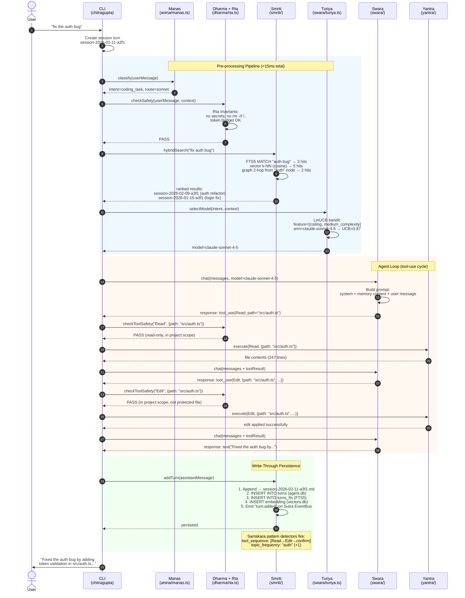
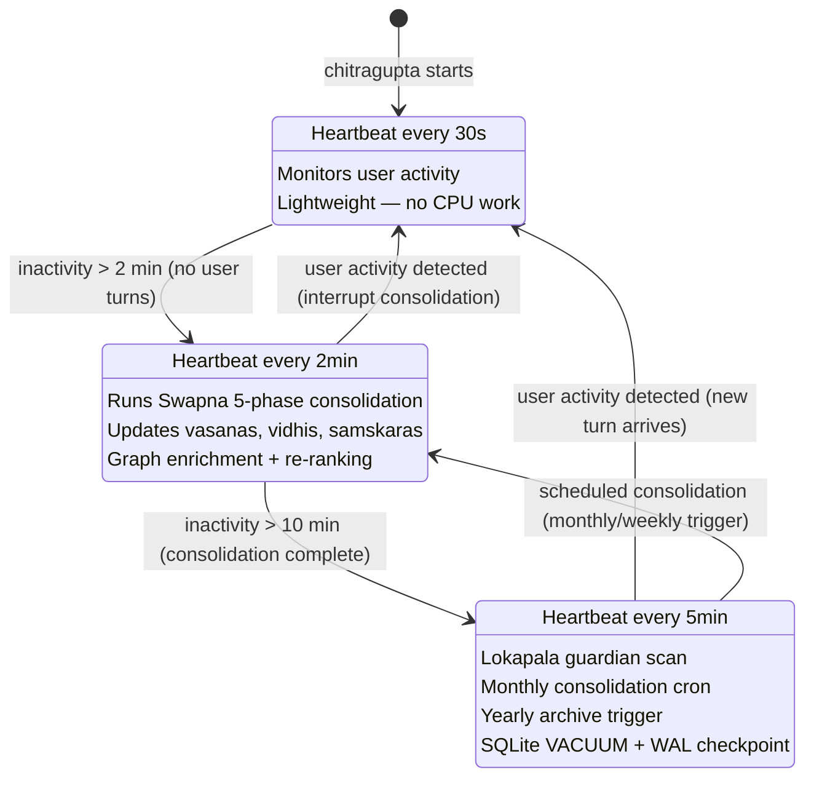
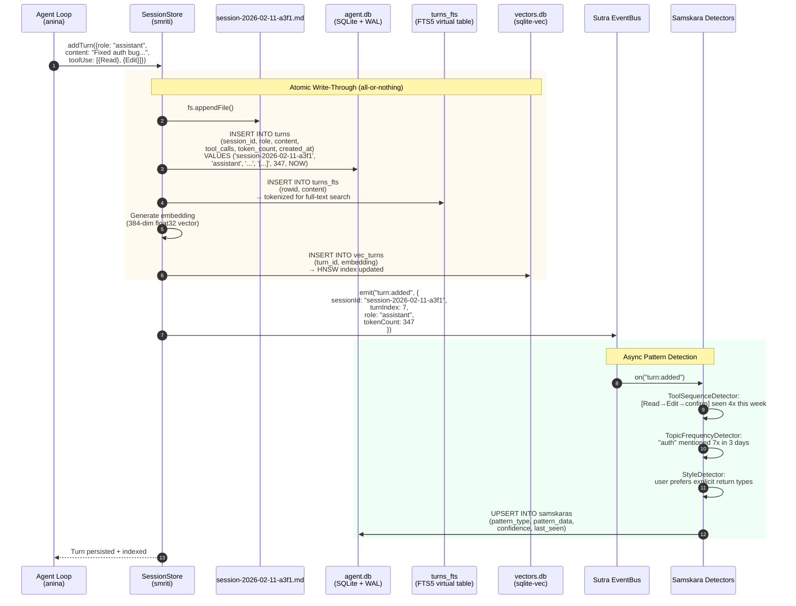

# CHITRAGUPTA — Architecture Guide

> Practical engineering reference for the 17-package monorepo.
> For algorithms & math, see [algorithms.md](./algorithms.md).
> For the Vedic cognitive models, see [vedic-models.md](./vedic-models.md).
> For ownership boundaries, see [component-responsibilities.md](./component-responsibilities.md).
> For runtime message flow, see [end-to-end-communication-flow.md](./end-to-end-communication-flow.md).

---

## Package Dependency Graph

The graph below focuses on the main runtime dependency spine. Some auxiliary packages and tooling surfaces are omitted for readability.

```
                         ┌──────────┐
                         │   cli    │  ← entry point (binary: chitragupta)
                         └────┬─────┘
                              │
           ┌──────────────────┼──────────────────┐
           │                  │                  │
      ┌────┴────┐       ┌────┴────┐       ┌─────┴────┐
      │  anina  │       │   ui    │       │  tantra  │
      │ (agent) │       │ (render)│       │ (MCP srv)│
      └────┬────┘       └─────────┘       └────┬─────┘
           │                                    │
    ┌──────┼──────┬──────────┬──────────────────┘
    │      │      │          │
┌───┴──┐┌──┴──┐┌──┴───┐┌────┴────┐
│smriti││swara││dharma ││  prana  │
│(mem) ││(LLM)││(rules)││ (DAG)  │
└──┬───┘└──┬──┘└───────┘└────┬───┘
   │       │                  │
   │  ┌────┴────┐      ┌─────┴─────┐
   │  │ niyanta │      │vidhya-skl │
   │  │(strategy│      │ (skills)  │
   │  └─────────┘      └───────────┘
   │
   ├── sutra (pub/sub, mesh)
   ├── netra (telemetry)
   └── yantra (tools)

   ┌──────┐
   │ core │  ← shared types, events, errors (depended on by ALL)
   └──────┘
```

### Package Responsibilities

| Package | Sanskrit | Role | Key Exports |
|---------|----------|------|-------------|
| **core** | — | Shared types, events, errors | `ChitraguptaSettings`, `EventBus`, `ChitraguptaError` |
| **swara** | Voice | LLM provider abstraction | `ProviderRegistry`, `chat()`, `stream()` |
| **anina** | Breath | Agent loop, ChetanaController | `Agent`, `ChetanaController`, context compaction |
| **smriti** | Memory | Sessions, search, graph, vectors | `SessionStore`, `search()`, `recall()`, `GraphRAG` |
| **yantra** | Machine | Tool implementations | `bashTool`, `readTool`, `writeTool`, etc. |
| **dharma** | Law | Safety rules, audit | `RuleEngine`, `audit()` |
| **niyanta** | Governor | Strategy selection (UCB1/LinUCB) | `StrategyBandit`, `ThompsonSampling` |
| **sutra** | Thread | Pub/sub, P2P mesh, gossip | `EventBus`, `Mesh`, `Mailbox` |
| **prana** | Life Force | DAG workflow engine and bounded research orchestration | `DAG`, `Pipeline`, `schedule()` |
| **tantra** | Loom | MCP server integration | `MCPServer`, tool/prompt/resource registration |
| **netra** | Eye | Telemetry, observability | `Tracer`, `MetricsCollector` |
| **vidhya-skills** | Knowledge | Pluggable skill system | `VidyaOrchestrator`, `SkillRegistry` |
| **ui** | — | Terminal rendering | `render()`, ANSI helpers, components |
| **cli** | — | CLI entry, commands, HTTP server | `chitragupta` binary, REST API |

The package graph explains code layout. The higher-level runtime ownership contract lives in [component-responsibilities.md](./component-responsibilities.md), and the request/response and background flow lives in [end-to-end-communication-flow.md](./end-to-end-communication-flow.md).

---

## Agentic Runtime Overlay

Lucy and Scarlett are not limited to outer MCP clients, external agents, or the Takumi bridge. They are internal runtime overlays across Chitragupta itself.

In practice that means the same autonomy/self-healing concepts show up across:

1. coding-path orchestration (`coding_agent`, Lucy bridge, Takumi compatibility bridge)
2. predictive context and recall (Transcendence, recall enrichment)
3. internal health and recovery loops (Scarlett, Triguna, autonomous MCP recovery)
4. internal memory/runtime wiring (Akasha traces, Buddhi decisions, Nidra lifecycle)

Use [runtime-integrity.md](./runtime-integrity.md) for the concrete nervous-system and integrity wiring, and the [Current Runtime Wiring](#current-runtime-wiring) section below for the architecture-level placement.

---

## Provenance Boundaries

This architecture guide distinguishes three layers of provenance:

1. Chitragupta-native architecture: the package graph, Sanskrit subsystem model, and internal runtime overlays such as Smriti, Akasha, Lucy, Scarlett, Nidra, and Buddhi
2. Adjacent product lineage: some CLI, session, and operator-workflow patterns sit in the same ecosystem as tools such as pi-mono and similar coding-agent systems
3. Research grounding: papers in [research.md](./research.md) serve as direct algorithmic anchors, heuristic influences, or architecture-level validation references depending on the subsystem

That means similarity in operator ergonomics should not be read as wholesale architectural derivation, and a research citation should not be read as a claim that the implementation is a direct paper port unless the algorithm is explicitly implemented as such.

---

## Local Runtime Policy

Chitragupta should support more than one local model runtime, but it should still own the routing and policy boundary.

Current control-plane policy:

1. Support both `llama.cpp` and `Ollama` as first-class local runtimes.
2. Prefer `llama.cpp` as the performance-first default backend for engine-owned local inference.
3. Keep `Ollama` as a supported convenience/distribution adapter and fallback runtime.
4. Vaayu, Takumi, and other consumers should request capability from Chitragupta instead of selecting the local runtime vendor directly.
5. Consumers should prefer engine route classes over raw vendor/model choices whenever a stable policy lane exists.

This keeps local-model choice inside the engine control plane rather than letting each consumer fork its own provider policy.

Current limitation:

- not every higher-level consumer routing path is fully migrated to engine-selected local-runtime lanes yet

## Discovery Control Plane

Chitragupta now treats provider/model discovery as an engine concern.

Current policy:

1. `kosha-discovery` contributes provider inventory, model routes, pricing, and provider health into the daemon control plane.
2. Chitragupta remains the routing authority. Discovery informs route resolution; it does not replace it.
3. `route.resolve` now returns `discoveryHints` beside the engine-selected lane so discovery data stays attached to the routing decision instead of living in a separate client-side registry.
4. Read-only discovery queries use the cached engine snapshot; explicit refresh is a separate write path through `discovery.refresh`.
5. Consumers should query discovery through daemon methods instead of building their own competing provider registries.
6. Consumers should prefer named route classes when they want a semantic lane such as:
   - `coding.fast-local`
   - `coding.review.strict`
   - `coding.validation-high-trust`
   - `memory.semantic-recall`
   - `chat.local-fast`
   - `chat.flex`
   - `tool.use.flex`
7. When a route class or raw capability maps to discovery-aware model lanes, the daemon can materialize discovered models into temporary routeable capabilities; discovery still informs the engine decision, it does not replace it.

Representative daemon methods:

- `discovery.info`
- `discovery.providers`
- `discovery.models`
- `discovery.roles`
- `discovery.cheapest`
- `discovery.routes`
- `discovery.capabilities`
- `discovery.health`
- `discovery.refresh`

## Route Classes

Chitragupta now exposes a route-class layer above the raw capability catalog.

Use route classes when a consumer wants a stable engine-owned lane instead of hardcoding a provider, CLI, or adapter:

1. `route.classes` lists the available route classes.
2. `route.resolve` accepts either:
   - a raw `capability`
   - a named `routeClass`
3. Route classes carry default constraints such as:
   - local preference
   - approval requirements
   - preferred adapters
4. Consumers can still tighten constraints, but they should not bypass the engine-owned lane definitions.

This is the intended split:

1. Chitragupta owns global route classes and route resolution.
2. Takumi may still schedule subtasks internally, but should do so inside engine-approved lanes.
3. External Vaayu should request route classes, not raw vendor names.

## Shared Mesh Runtime

Within one CLI process, MCP mode, serve-mode mesh observability, and TUI mesh helpers now share one process-local ActorSystem runtime instead of spinning up unrelated mesh views.

That means:

1. local built-in actors share one liveness source
2. capability routing is visible consistently across surfaces
3. HTTP mesh status and MCP mesh tools report from one snapshot source in that process

Remote P2P still depends on explicit `CHITRAGUPTA_MESH_*` bootstrap configuration.

## Compression Runtime Policy

Compression should follow the same engine-owned pattern as model/runtime routing.

Current policy:

1. Support `PAKT` as a separate executable capability, not as a second memory authority.
2. Prefer direct `pakt-core` library use inside the engine and keep stdio `pakt serve --stdio` as a fallback runtime.
3. Keep compressed artifacts derived and provenance-linked to canonical sessions and consolidations.
4. Let Vaayu, Takumi, and future consumers request compression capability from Chitragupta instead of invoking their own durable compaction authority.
5. Treat `PAKT` as preferred only when a healthy runtime is available; routing should not overclaim it.
6. Use PAKT-packed summaries as additive transport/context artifacts while keeping semantic embeddings on the original curated summary text.
7. Apply the same derived-only rule to Nidra/Swapna compaction summaries: compression may improve transport and recall, but it never replaces canonical session truth.
8. Use the daemon compression surface first for live-context packing (`compression.pack_context`) so Lucy/MCP guidance stays inside engine policy when the daemon is reachable.
9. Treat a daemon `packed: false` result as authoritative while the daemon is reachable; local packing is only a daemon-unavailable fallback.
9. Apply that same daemon-first packing path to Transcendence and Vasana prompt enrichment so serve/API/agent prompt assembly does not drift from MCP/Lucy behavior.

## Distributed Sabha Replication

Sabha persistence is no longer only snapshot-based.

Current replication model:

1. `sabha.events` and `sabha.sync` expose revisioned event-log reads.
2. `sabha.repl.pull` returns read-only replicated state without resuming runtime side effects.
3. `sabha.repl.apply` remains the low-level snapshot apply path.
4. `sabha.repl.merge` now provides oplog-aware fast-forward semantics when the local replica is an ancestry prefix of the incoming event log.

This keeps restart-safe council continuity while reducing blind snapshot overwrites in multi-node replication paths.

## Engine-Native Research Workflows

Chitragupta now treats bounded research loops as part of the engine rather than as an external agent pattern.

Current workflow templates:

1. `autoresearch`
   - scope a bounded experiment
   - convene an ACP/Sabha council
   - capture a baseline
   - run a hard time-boxed experiment
   - evaluate keep/discard
   - pack context through PAKT
   - persist the outcome into Smriti and Akasha
2. `acp-research-swarm`
   - scope a research topic
   - run an ACP/Sutra council
   - pack the council context
   - persist the council output

This is the intended boundary:

1. Chitragupta owns the daemon bridge, workflow policy, council semantics, and durable memory.
2. Takumi may execute code changes inside that envelope, but is not the experiment ledger authority.
3. Vaayu surfaces and orchestrates the workflows, but does not become the durable research-memory authority.

---

## Data Flow

### 1. Request Path (User → Response)

```
User Input
    │
    ▼
┌─────────────────────────────────┐
│ Manas Pre-Processor             │  ← regex intent + keyword extract (<5ms)
│ (packages/anina/src/manas.ts)   │     route: no-LLM | haiku | sonnet | opus
└─────────┬───────────────────────┘
          │
          ▼
┌─────────────────────────────────┐
│ Dharma + Rta Check              │  ← safety invariants
│ (packages/dharma/)              │
└─────────┬───────────────────────┘
          │
          ▼
┌─────────────────────────────────┐
│ Smriti Retrieval                │  ← hybrid search: FTS5 + vectors + graph
│ (packages/smriti/)              │     L1 cache → SQLite/FTS/local semantic
│                                 │     → optional curated remote semantic mirror
└─────────┬───────────────────────┘
          │
          ▼
┌─────────────────────────────────┐
│ Turiya Model Router             │  ← LinUCB picks model tier
│ (packages/swara/src/turiya.ts)  │
└─────────┬───────────────────────┘
          │
          ▼
┌─────────────────────────────────┐
│ Swara LLM Call                  │  ← stream/chat with selected model
│ (packages/swara/)               │
└─────────┬───────────────────────┘
          │
          ▼
┌─────────────────────────────────┐
│ Yantra Tool Execution           │  ← if tool_use in response
│ (packages/yantra/)              │     loop back to Dharma check
└─────────┬───────────────────────┘
          │
          ▼
┌─────────────────────────────────┐
│ Smriti Write-Through            │  ← append to session.md + SQLite index
│ (packages/smriti/)              │     + Samskara pattern detection
└─────────────────────────────────┘
```

### 2. Write Path (Session Persistence)

```
addTurn(turn)
    │
    ├──► Append to session-YYYY-MM-DD.md  (human-readable source of truth)
    │
    ├──► INSERT INTO turns (SQLite agent.db)
    │
    ├──► INSERT INTO turns_fts (FTS5 index)
    │
    ├──► INSERT embedding into vectors.db (sqlite-vec)
    │
    └──► Emit "turn:added" on Sutra EventBus
              │
              └──► Samskara pattern detectors listen
```

### 3. Consolidation Path (Background)

```
┌─────────────────────────────────────────────────┐
│  Nidra Daemon (always running)                  │
│                                                 │
│  LISTENING ──► DREAMING ──► DEEP_SLEEP          │
│  (30s beat)   (2min beat)   (5min beat)         │
│                                                 │
│  DREAMING triggers:                             │
│  ┌─────────────────────────────────────────┐    │
│  │ Swapna 5-Phase Consolidation            │    │
│  │ 1. REPLAY    — re-traverse, surprise    │    │
│  │ 2. RECOMBINE — cross-session patterns   │    │
│  │ 3. CRYSTALLIZE — BOCPD, samskaras→vasana│    │
│  │ 4. PROCEDURALIZE — tool seq → vidhis    │    │
│  │ 5. COMPRESS  — Sinkhorn-Knopp weighted  │    │
│  └─────────────────────────────────────────┘    │
│                                                 │
│  DEEP_SLEEP triggers:                           │
│  ┌─────────────────────────────────────────┐    │
│  │ Exact pending sessions grouped by       │    │
│  │ project feed Swapna without broadening  │    │
│  │ the scope to unrelated recent sessions  │    │
│  │ Curated consolidation artifacts keep    │    │
│  │ provenance and become the semantic      │    │
│  │ mirror source of truth                  │    │
│  │ Periodic reports and archives are       │    │
│  │ downstream outputs, not the trigger     │    │
│  │ model for deep-sleep consolidation      │    │
│  │ Lokapala Scan — security/perf/correct   │    │
│  └─────────────────────────────────────────┘    │
└─────────────────────────────────────────────────┘
```

---

## Storage Architecture

### Databases (all under `~/.chitragupta/`)

| Database | Engine | Contents | Hot Cache |
|----------|--------|----------|-----------|
| `agent.db` | SQLite + WAL | sessions, turns, turns_fts, consolidation_rules, vasanas, kartavyas | LRU (100 sessions) |
| `graph.db` | SQLite + WAL | nodes, edges, pagerank | Adjacency LRU (1000 nodes) |
| `vectors.db` | SQLite + sqlite-vec | embeddings, HNSW index | None (sqlite-vec is fast) |

### File Layout

```
~/.chitragupta/
├── agent.db                        # Sessions, turns, FTS5, vasanas
├── graph.db                        # Knowledge graph
├── vectors.db                      # Embeddings (sqlite-vec)
├── projects/
│   └── <hash>/
│       ├── sessions/
│       │   └── YYYY/MM/
│       │       └── session-YYYY-MM-DD.md      # Daily session (append-only)
│       ├── consolidated/
│       │   ├── monthly/YYYY-MM.md             # Derived report with source-session provenance
│       │   └── yearly/YYYY.md                 # Derived report with source-session provenance
│       └── memory/
│           ├── identity.md
│           ├── projects.md
│           ├── tasks.md
│           └── flow.md
├── vasanas/                        # Behavioral tendencies (also in agent.db)
├── vidhis/                         # Learned procedures
└── config.json
```

### Three-Tier Data Lifecycle

```
HOT (in-process)          WARM (local SQLite)         COLD (remote / optional)
──────────────────        ──────────────────          ──────────────
L1 LRU cache              agent.db (FTS5)             Qdrant (curated semantic mirror)
Recent sessions           vectors.db (sqlite-vec)     S3/Azure (archives)
Active graph neighbors    graph.db                    Yearly .tar.gz
────── ms latency ──────  ────── <50ms latency ─────  ── 100-500ms ──

                Daily write-through ──►
                Curated semantic mirror sync ───────►
                Yearly archive + VACUUM ────────────►
```

---

## Multi-Project Support

Sessions are scoped by project via `project TEXT NOT NULL` in the sessions table.

### Per-Project
- Session files: `projects/<hash>/sessions/`
- Consolidated reports: `projects/<hash>/consolidated/`
- Memory streams: `projects/<hash>/memory/`
- SQLite queries filtered by `WHERE project = ?`
- Session lineage defaults to isolated threads per consumer surface unless explicit same-day reuse metadata is supplied
- Project resolution is exact-path based after normalization. The daemon no longer aliases by basename or suffix because that can mis-bind similarly named repositories.

### Cross-Project (Global)
- Vasanas appearing across 3+ projects are promoted to global vasanas
- Global vasanas stored in `agent.db` with `project = '__global__'`
- User preferences, coding style, general facts are cross-project
- Global Scarlett health signals may influence all projects, but project-scoped Lucy live context does not inherit another project's scoped regression state
- Search priority: current project → global → other projects (only if explicit)

---

## Key Design Decisions

1. **Single new dependency**: `better-sqlite3` (+ `sqlite-vec` extension). Runtime now prefers a daemon-owned single-writer process instead of pretending everything is purely in-process.
2. **Markdown-authoritative sessions**: `.md` files remain the source of truth, but they can be rewritten during normal metadata and durability flows. SQLite is the index, not the source of truth.
3. **Write-through**: Every write goes to both `.md` and SQLite atomically.
4. **WAL mode**: Readers never block writers. Consolidation runs alongside live queries.
5. **Derived artifacts preserve provenance**: day files and periodic reports are summaries for reading and recall, may compact low-signal session detail for readability, and still embed source-session references so drill-down can always return to canonical raw sessions.
6. **No breaking changes**: Existing `.md` sessions are migrated on first run. Old data is preserved.
7. **Turiya routes, not replaces**: Model routing is additive — user can override.
8. **Lokapala are always-on**: Guardian agents run in Nidra DEEP_SLEEP, not on-demand.
9. **Kartavya requires niyama approval**: No auto-execution without user opt-in first.

---

## Current Runtime Wiring

This section documents what is wired in the current runtime, not the full conceptual ceiling.

Current as of March 7, 2026.

This section is intentionally source-backed. If a capability only exists in a design note or future binding plan, it is called out as future work rather than documented here as live wiring.

### Lucy and Scarlett Scope

Lucy and Scarlett are internal Chitragupta runtime concepts at platform scope.

| Runtime concept | Platform meaning | Practical note |
| --- | --- | --- |
| Lucy | Platform-wide autonomy and context-injection concept used across Chitragupta runtime flows | The coding path is one important consumer, but it is not the full definition of Lucy |
| Scarlett | Platform-wide health/watchdog concept for runtime supervision and recovery | Some Scarlett signals are wired today, but not every Scarlett signal is shared end-to-end with every Lucy caller |

### Live Prompt Assembly

The Anina agent now rebuilds its effective system prompt on every prompt turn from:

1. base system prompt
2. freshly loaded memory prompt context
3. persisted soul prompt, if available

If a later memory refresh fails, the agent falls back to the last successful memory prompt context. This keeps live sessions resilient without hiding mid-session memory changes behind a long-lived prompt snapshot.

### Daemon-Owned Memory Bridge

The main runtime surfaces now construct one daemon-backed `MemoryBridge` object and pass that same object into the Anina agent runtime.

This matters because:

- CLI/TUI, API, and serve no longer assemble memory context from one bridge while the agent writes turns through another local writer.
- session creation, turn persistence, and project-memory bubble-up follow the daemon-owned single-writer path by default.
- local persistence fallback only activates when explicit local fallback is enabled.

### Fresh / No-Cache Semantics

The current fresh-mode contract is intentionally narrow and semantic:

- Lucy skips Transcendence predictive hits when `noCache` is requested
- `chitragupta_recall` accepts `noCache` and `fresh` to suppress predicted hits
- the Takumi bridge receives fresh intent through prompt text, env vars, and result metadata

This is not a blanket "disable every cache in the process" switch. It is scoped to predictive context and live recall/coding context.

### Serve-Mode Wiring That Is Live

| Path | Current behavior |
| --- | --- |
| MemoryBridge | Serve mode uses the same daemon-backed MemoryBridge model as the rest of the main runtime surfaces |
| Skill gap -> Akasha | Missing-tool events leave real Akasha traces and can feed Vidya gap tracking |
| Lokapala -> Akasha | Warning and critical guardian findings leave Akasha traces |
| Buddhi | Significant tool decisions are recorded from agent events |
| Nidra | Serve mode sends `touch()` on every prompt and registers one logical session id per serve chat session |
| Triguna / Chetana | Health events can flow into the serve-mode actuator path |
| Deep sleep maintenance | WAL checkpoint, VACUUM, FTS optimize, and consolidation pruning run from the deep-sleep hook |

### MCP Nervous-System Coverage

MCP mode now participates in the main nervous-system path for generic task tools:

- Lucy live guidance is resolved before wrapped MCP tools return text results
- Vasana behavioral hints can be attached to those wrapped MCP tool results
- Buddhi records significant MCP tool decisions through the daemon-backed proxy
- MCP tool calls also update Triguna telemetry instead of leaving that path dark

MCP is still a different runtime surface from the interactive agent loop, but it no longer bypasses Lucy/Buddhi/Triguna for normal task-oriented tool execution.

### Autonomous MCP Recovery

The MCP autonomous layer now treats quarantine expiry as a recovery event instead of a metadata cleanup only:

- breaker config is rebuilt from startup overrides
- a periodic quarantine sweep attempts recovery after expiry
- successful recovery clears quarantine state and crash history
- failed recovery remains quarantined for later retries

This makes quarantined MCP servers recoverable without requiring a manual restart.

### Runtime Links Still Split

Some runtime concepts are broader than their current wiring:

| Gap | Why it matters |
| --- | --- |
| Scarlett and Lucy do not yet share one process-wide Transcendence instance | Daemon-side health signals do not directly shape every CLI-side predictive context decision |
| Sabha persistence is revisioned but not yet a full distributed merge log | Current daemon CAS + event log is strong enough for restart durability, but not yet the final multi-node oplog/CAS design |
| Takumi integration still targets CLI compatibility instead of a dedicated runtime protocol | The bridge is practical today, but a stable RPC/headless contract is still future work |
| Dedicated Takumi runtime protocol still lags the current daemon binding surface | Observation, prediction, preference, and heal-report methods are live in the daemon, but Takumi still uses a practical compatibility bridge instead of the final dedicated protocol |
| Fresh-mode scope is semantic, not universal | Predictive context is bypassed, but not every process-local convenience cache is part of the contract |
| Standalone `@chitragupta/anina` embedding can still use local persistence defaults | The main Chitragupta runtime is daemon-first, but library consumers outside that runtime can still opt into local persistence unless they inject a daemon-backed bridge |

For the user-facing coding path, see [coding-agent.md](./coding-agent.md).

---

## Performance Targets

| Operation | Target | Approach |
|-----------|--------|----------|
| Session list | <10ms | SQLite indexed query |
| Full-text search | <10ms | FTS5 MATCH + rank |
| Vector k-NN (10K) | <5ms | sqlite-vec HNSW |
| Graph neighbor lookup | <1ms | SQLite + LRU cache |
| Turiya routing | <2ms | LinUCB (no LLM) |
| Manas classification | <5ms | Regex + keywords |
| Triguna update | <1ms | Kalman filter step |
| Pratyabhijna warm-up | <30ms | Top-K vasanas + samskaras |
| Swapna full cycle | <20s | Worker thread |
| Hybrid search (FTS+vec+graph) | <30ms | Parallel + merge |

---

## Interactive Diagrams (Mermaid)

> The ASCII diagrams above are the authoritative quick-reference.
> The Mermaid diagrams below provide richer, interactive versions with concrete examples.

### Example: User Asks "Fix the auth bug" — Full Request Path



### Nidra Sleep Cycle — State Machine



### Swapna 5-Phase Consolidation — Flowchart

```mermaid
flowchart TD
    START([Nidra enters DREAMING]) --> REPLAY

    subgraph Phase1["Phase 1: REPLAY"]
        REPLAY[Re-traverse today's sessions]
        REPLAY --> SURPRISE[Calculate surprise scores<br/>per turn using KL-divergence]
        SURPRISE --> HIGH{Surprise > threshold?}
        HIGH -->|Yes| TAG[Tag as novel pattern<br/>for Phase 2]
        HIGH -->|No| SKIP[Mark as routine]
    end

    TAG --> RECOMBINE_START
    SKIP --> RECOMBINE_START

    subgraph Phase2["Phase 2: RECOMBINE"]
        RECOMBINE_START[Cross-session pattern detection]
        RECOMBINE_START --> CLUSTER[Cluster similar turns<br/>across sessions via embeddings]
        CLUSTER --> BRIDGE[Detect bridging patterns<br/>e.g. auth→testing→deploy]
    end

    BRIDGE --> CRYSTALLIZE_START

    subgraph Phase3["Phase 3: CRYSTALLIZE"]
        CRYSTALLIZE_START[BOCPD change-point detection]
        CRYSTALLIZE_START --> CHANGEPOINT{Change-point<br/>detected?}
        CHANGEPOINT -->|Yes| VASANA[Promote samskara → vasana<br/>e.g. 'prefers explicit types']
        CHANGEPOINT -->|No| KEEP[Keep as samskara<br/>needs more evidence]
        VASANA --> GLOBAL{Seen in 3+<br/>projects?}
        GLOBAL -->|Yes| PROMOTE[Promote to global vasana<br/>project = '__global__']
        GLOBAL -->|No| LOCAL[Keep as project vasana]
    end

    KEEP --> PROC_START
    PROMOTE --> PROC_START
    LOCAL --> PROC_START

    subgraph Phase4["Phase 4: PROCEDURALIZE"]
        PROC_START[Detect repeated tool sequences]
        PROC_START --> SEQMINE[Mine frequent subsequences<br/>e.g. Read→Edit→bash test]
        SEQMINE --> VIDHI{Frequency ≥ 3<br/>in 7 days?}
        VIDHI -->|Yes| CREATE_VIDHI[Create vidhi<br/>learned procedure]
        VIDHI -->|No| WAIT[Accumulate more evidence]
    end

    CREATE_VIDHI --> COMPRESS_START
    WAIT --> COMPRESS_START

    subgraph Phase5["Phase 5: COMPRESS"]
        COMPRESS_START[Sinkhorn-Knopp weighted compression]
        COMPRESS_START --> WEIGHT[Assign importance weights:<br/>high-surprise=1.0, routine=0.3]
        WEIGHT --> SINKHORN[Doubly-stochastic normalization<br/>balances recency vs novelty]
        SINKHORN --> TRIM[Trim low-weight entries<br/>from memory streams]
        TRIM --> UPDATE_STREAMS[Update identity.md, tasks.md,<br/>projects.md, flow.md]
    end

    UPDATE_STREAMS --> DONE([Return to Nidra<br/>advance to DEEP_SLEEP or LISTENING])

    style Phase1 fill:#e8f4fd,stroke:#4a90d9
    style Phase2 fill:#fdf2e8,stroke:#d9904a
    style Phase3 fill:#e8fde8,stroke:#4ad94a
    style Phase4 fill:#f2e8fd,stroke:#904ad9
    style Phase5 fill:#fde8e8,stroke:#d94a4a
```



### Write-Through Path — Persistence Detail



---

*See also: [algorithms.md](./algorithms.md) | [api.md](./api.md) | [vedic-models.md](./vedic-models.md) | [research.md](./research.md)*
