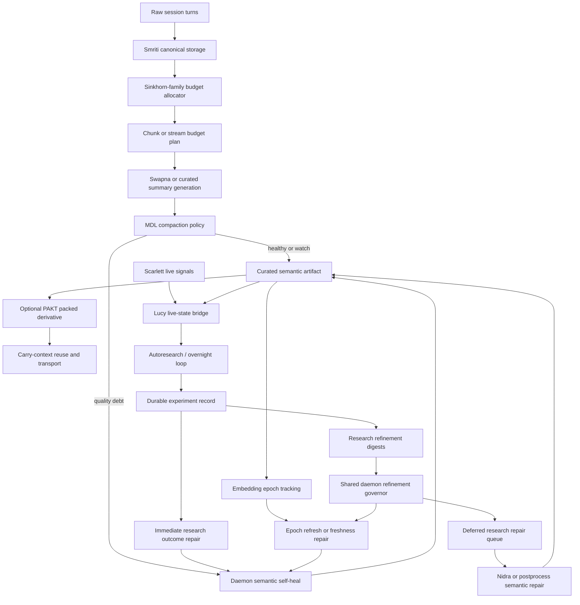

# Compaction And Refinement

This document explains how Chitragupta uses compaction, compression, refinement, and bounded research together.

I wrote it to answer four operator questions directly:

1. Where does `mHC` fit?
2. Where does `MDL` fit?
3. What does `autoresearch` actually improve?
4. Which subsystem owns each step?

## Short Answer

- Sinkhorn-family budget allocation is on the live compaction path, and the explicit `mHC` helper is one concrete allocator in that family.
- `MDL` is the quality gate and one repair signal inside the broader semantic refinement policy.
- `PAKT` is the engine-owned compression capability.
- `autoresearch` is the bounded optimizer loop that creates new refinement pressure and durable learning signals.
- `Nidra` is the maintenance path that digests those outcomes back into memory and semantic repair.

These are complementary layers, not competing implementations of the same thing.

## Internal Naming

| Concern | Internal naming |
| --- | --- |
| Bounded autonomous research loop | `autoresearch`, `autoresearch-overnight`, `acp-research-swarm` |
| Live intuition | `Lucy` |
| Integrity and healing | `Scarlett` |
| Canonical memory and semantic artifacts | `Smriti` |
| Sleep-cycle consolidation | `Nidra` / `Swapna` |
| Engine-owned compression capability | `PAKT` |
| Compaction quality policy | `MDL compaction policy` |
| Token budget allocator | `Sinkhorn-family budget allocator` |

I keep the external paper names as references. I keep the runtime language Chitragupta-native.

## Strict Table

| External idea | Our internal naming | Runtime seam | What it does here | What it improves |
| --- | --- | --- | --- | --- |
| Auto-search / bounded self-improvement | `autoresearch`, `autoresearch-overnight` | `packages/prana/src/chitragupta-nodes-research-*`, [research-workflows.md](./research-workflows.md) | Runs bounded experiments with routes, checkpoints, council, stop conditions, policy snapshots, and durable recording | autonomy, bounded evolution, durable experiment memory |
| Live intuition | `Lucy` | `daemon: lucy.live_context`, `packages/daemon/src/lucy-live-state.ts` | Serves live predictions, hits, and warning context into prompts and research councils | anticipatory guidance, prompt shaping, caution signals |
| Integrity / live health | `Scarlett` | `packages/daemon/src/scarlett-internal.ts`, `packages/daemon/src/scarlett-signal-bridge.ts` | Detects regressions and heal events, feeds the live-state bridge, keeps health truth current | awareness, anomaly visibility, self-healing posture |
| Modified Hierarchical Compaction | `Sinkhorn-family budget allocator` | `packages/smriti/src/compactor.ts`, `packages/smriti/src/sinkhorn-budget.ts`, `packages/smriti/src/sinkhorn-knopp.ts`, `packages/smriti/src/swapna-consolidation.ts` | Allocates limited compaction budget across streams or chunks using Sinkhorn-family normalization before preservation and gist-writing; the explicit `computeTokenBudgetsMHC(...)` helper is one concrete allocator in that family | structured compaction budget allocation |
| Minimum Description Length style compaction | `MDL compaction policy` | `packages/smriti/src/mdl-compaction.ts`, `packages/smriti/src/semantic-refinement-policy.ts` | Scores summary quality by signal retention and reduction, then feeds one of the repair signals used by the daemon-owned semantic refinement policy | summary quality, retrieval quality, repair prioritization |
| Engine compression capability | `PAKT` | `packages/smriti/src/pakt-compression.ts`, daemon `compression.*` methods | Packs and normalizes text for transport and carry-context reuse | smaller context, better handoff, cheaper reuse |
| Dream-state compaction | `Swapna compression policy` | `packages/smriti/src/swapna-compression-policy.ts` | Applies PAKT plus MDL gates to dream-state summaries before promoting packed derivatives | safer packed summaries, less lossy compaction |
| Selective semantic repair | `selective re-embedding`, `epoch refresh` | `packages/smriti/src/selective-reembedding.ts`, `packages/smriti/src/semantic-refinement-policy.ts`, `packages/smriti/src/embedding-epoch.ts`, `packages/smriti/src/semantic-epoch-refresh.ts` | Repairs only stale or low-quality curated artifacts instead of forcing a blanket refresh | self-heal, semantic mirror quality, automatic reindex |
| Research digestion | `research refinement digests`, `shared daemon refinement governor` | `packages/anina/src/chitragupta-daemon-research.ts`, `packages/anina/src/chitragupta-daemon-postprocess.ts`, `packages/anina/src/chitragupta-daemon-refinement-governor.ts`, `packages/anina/src/chitragupta-daemon-deep-sleep.ts` | Turns overnight outcomes into project-scoped refinement scopes, budgets, queue carry-forward, and repair pressure that can be consumed by daily postprocess, deep sleep, and epoch-refresh queue drain | evolution, memory refinement, semantic repair planning |

## mHC Versus MDL

| Aspect | Sinkhorn-family budgeting in ours | `MDL` in ours |
| --- | --- | --- |
| Primary role | budget allocator | quality gate and repair signal |
| Main question | “How much budget should each chunk or stream get?” | “Is this summary or packed artifact good enough to keep?” |
| Main inputs | recency, relevance, importance, topic affinity | signal retention, reduction, packed utility |
| Main output | token budget map | healthy/watch/repair decision |
| Scope | chunk-level or stream-level allocation | curated summaries, packed derivatives, semantic repair |

I use them together:

- Sinkhorn-family allocation decides where scarce compaction budget goes on the live stream and chunk compaction path.
- `MDL` decides whether the resulting compressed artifact is worth trusting and contributes one of the signals that can trigger later repair.

## Ownership Diagram

## Autoresearch Feedback Loop

`autoresearch` improves the engine in four concrete ways.

### 1. It improves memory quality

I persist:

- council verdicts
- route provenance
- optimizer policy fingerprint
- stop-condition hits
- frontier-best score
- packed carry-context
- experiment outcomes

That means experiments become reusable engine memory instead of disposable logs.

### 2. It improves Lucy

Research councils call `lucy.live_context` before execution.

That means:

- live warnings can challenge the council
- live predictions can become evidence
- a blocking Scarlett signal can stop or narrow the experiment

Later, the artifacts Lucy reads from improve because low-quality semantic artifacts can be repaired selectively.

### 3. It improves Scarlett

Research outcomes now widen real daemon-owned repair pressure.

That means Scarlett can report truthful debt such as:

- mirror drift
- stale semantic health
- daemon health anomalies

The deeper project-scoped repair backlog and remote-publish hold reasons are currently computed by daemon postprocess and the shared refinement governor, not by Scarlett probes directly.

That is better than “health is green because nothing yelled loudly enough.”

### 4. It improves Nidra

Research outcomes first trigger a bounded immediate day/project repair when the result is recorded, and later Nidra plus daemon postprocess digest the same outcomes into:

- per-project refinement digests
- shared repair budgets
- bounded deferred research-queue replay
- project-scoped semantic repair

That turns overnight work into next-cycle maintenance pressure.

## Why PAKT Is Separate

I keep `PAKT` separate from both `mHC` and `MDL`.

- `PAKT` is a compression capability.
- Sinkhorn-family allocation is a budget allocator.
- `MDL` is a quality gate and repair signal.

`PAKT` makes text smaller and reusable.
`MDL` decides whether the packed or summarized result is good enough to promote.
Sinkhorn-family allocation decides how much budget should be spent before that compression happens.

## What This Means Operationally

If an operator asks “why did this artifact get repaired?”, the answer should now be traceable to:

- embedding epoch drift
- low `mdlScore`
- low retention
- bounded research-derived refinement pressure
- queued carry-forward after one cycle cap

If an operator asks “why did this artifact survive compaction?”, the answer should now be traceable to:

- higher `mHC` budget allocation
- stronger `MDL` quality metrics
- acceptable packed derivative decision

## Practical Rule

I use this rule of thumb throughout the engine:

- Sinkhorn-family allocation tells me how much to keep.
- `MDL` tells me whether what I kept is good enough.
- `PAKT` tells me how to transport it cheaply.
- `autoresearch` tells me what deserves more refinement pressure next.
- `Nidra` turns that pressure into actual repair and consolidation work.

## See Also

- [algorithms.md](./algorithms.md)
- [research-workflows.md](./research-workflows.md)
- [current-status.md](./current-status.md)
- [architecture.md](./architecture.md)
