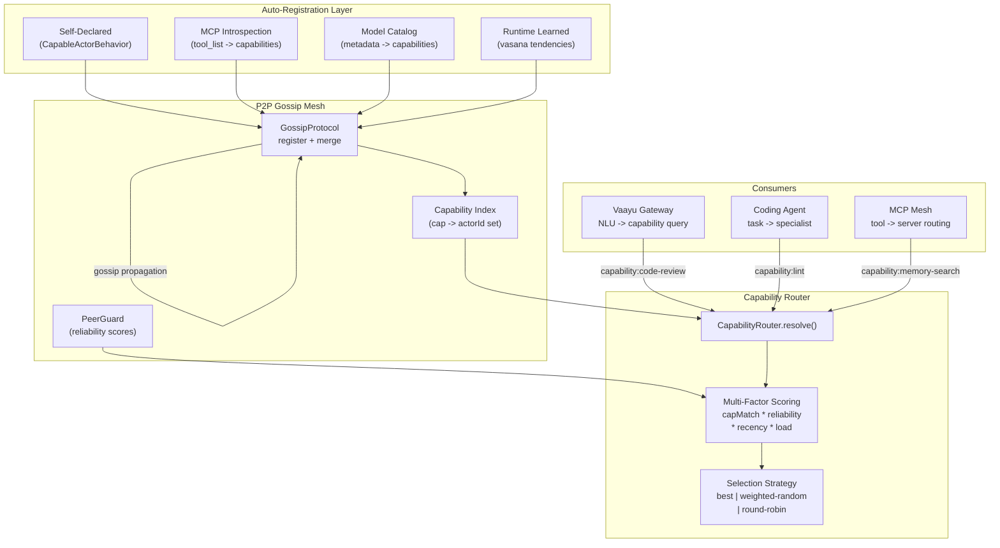
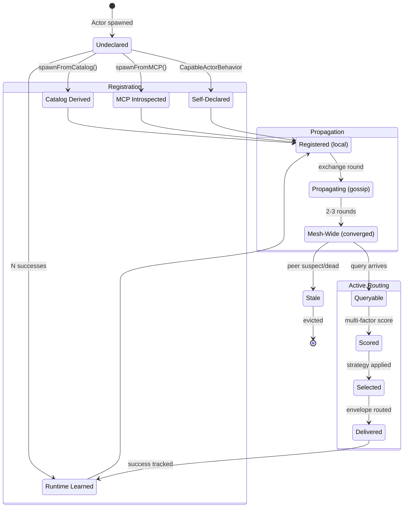
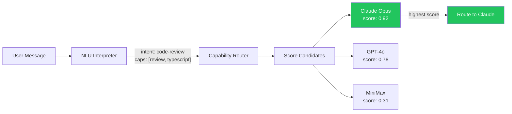
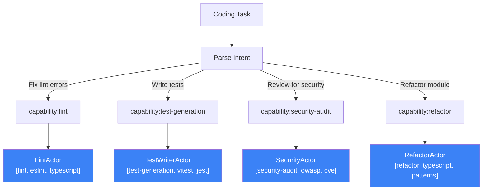
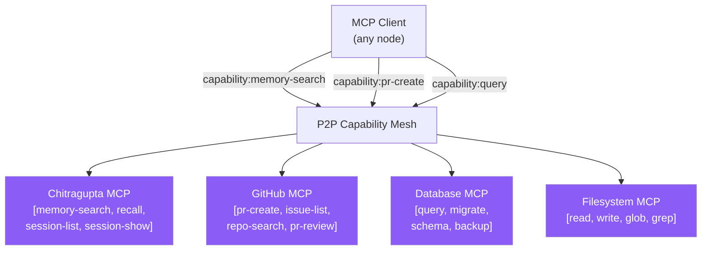

# Capability-Aware Routing for P2P Actor Mesh

> Gossip-propagated capability matching with multi-factor scoring.
> Zero external dependencies. Fully decentralized. Eventually consistent.

## Why This Exists

Traditional actor meshes route by **ID** — you must know exactly which actor to talk to. This breaks in dynamic systems where:

- Agents come and go (scaling, failures, deployments)
- The caller doesn't care WHO does the work, only WHAT capabilities are needed
- Load must be distributed across equivalent actors
- New specialists should be instantly routable without reconfiguration

**Capability routing** flips the model: describe what you need, the mesh finds who can do it.

```typescript
// Before: caller must know the exact actor ID
system.tell("caller", "actor-xyz-123", payload);

// After: describe the capability, mesh routes automatically
system.tell("caller", "capability:code-review", payload);

// Or with multiple required capabilities
system.tell("caller", target, payload, {
  requiredCapabilities: ["typescript", "security-audit"],
});
```

---

## Architecture Overview



---

## Auto-Registration Flow

Capabilities are **never manually configured**. Four registration sources feed into the gossip protocol automatically:

```mermaid
sequenceDiagram
    participant Dev as Developer/System
    participant AS as ActorSystem
    participant Actor as Actor
    participant GP as GossipProtocol
    participant NG as NetworkGossip
    participant Remote as Remote Nodes
    participant CR as CapabilityRouter

    Note over Dev,CR: Phase 1 — Auto-Registration
    Dev->>AS: spawn("reviewer", capableBehavior)
    AS->>AS: Extract capabilities from behavior metadata
    AS->>Actor: Create Actor instance
    AS->>GP: register("reviewer", capabilities)
    GP->>GP: Store PeerView with capabilities

    Note over Dev,CR: Phase 2 — Gossip Propagation
    NG->>GP: getView() for gossip exchange
    GP-->>NG: PeerView[] including capabilities
    NG->>Remote: sendGossip(stampedViews)
    Remote->>Remote: merge() + updateCapabilityIndex()

    Note over Dev,CR: Phase 3 — Capability Routing
    Dev->>AS: send("capability:code-review", msg)
    AS->>CR: resolve({capabilities: ["code-review"]})
    CR->>GP: findByCapability("code-review")
    GP-->>CR: matching PeerView[]
    CR->>CR: score() with multi-factor formula
    CR->>CR: select(strategy)
    CR-->>AS: Best PeerView
    AS->>Remote: Route envelope to peer
```

### Registration Source 1: Self-Declared Behaviors

The actor behavior itself declares what it can do:

```typescript
import type { CapableActorBehavior } from "@chitragupta/sutra";

const reviewerBehavior: CapableActorBehavior = {
  capabilities: ["code-review", "typescript", "security-audit"],
  handle: (envelope, ctx) => {
    // process review request
    ctx.reply({ approved: true, comments: [] });
  },
};

// spawn auto-extracts capabilities from behavior metadata
const ref = system.spawn("reviewer", { behavior: reviewerBehavior });
// Registers: capabilities = ["code-review", "typescript", "security-audit"]
```

### Registration Source 2: MCP Tool Introspection

When an actor wraps an MCP server, tool names become capabilities automatically:

```typescript
// MCP server exposes: memory_search, recall, session_list, session_show
const ref = await system.spawnFromMCP("chitragupta-memory", mcpTransport);
// Auto-registers: capabilities = ["memory-search", "recall", "session-list", "session-show"]

// Now any node in the mesh can:
system.tell("caller", "capability:memory-search", { query: "auth patterns" });
// Routes to the chitragupta-memory actor automatically
```

### Registration Source 3: Model Catalog (Vaayu)

Model metadata from the catalog maps directly to capabilities:

```typescript
// Model catalog entry for Claude Opus
{ id: "claude-opus-4", capabilities: ["reasoning", "code-gen", "long-context", "analysis"] }

// Model catalog entry for DALL-E
{ id: "dall-e-3", capabilities: ["image-generation", "creative"] }

// Vaayu spawns model actors from catalog — capabilities auto-registered
for (const model of catalog) {
  system.spawn(model.id, {
    behavior: modelProxyBehavior(model),
    capabilities: model.capabilities,
  });
}
```

### Registration Source 4: Runtime Learned (Vasana)

Actors that successfully handle certain message types learn capabilities over time:

```typescript
// Actor "helper" handles 10 "lint" messages successfully
// Runtime tracker promotes "lint" to declared capability
// Now the mesh routes lint requests to "helper" automatically

// This mirrors Vasana (behavioral tendencies):
// past actions shape future routing, no configuration needed
```

---

## Capability Lifecycle



---

## Multi-Factor Scoring

Every candidate peer is scored before selection:

```
score = capabilityMatch * reliability * recency * loadFactor
```

| Factor | Formula | Range | Source |
|--------|---------|-------|--------|
| `capabilityMatch` | matchedCaps / requiredCaps | 0..1 | GossipProtocol |
| `reliability` | successes / (successes + failures) | 0..1 | PeerGuard |
| `recency` | max(0.1, 1 - ageHours / 24) | 0.1..1 | PeerView.lastSeen |
| `loadFactor` | 1 / (1 + actorCount / 100) | 0..1 | CapabilityRouter.loadMap |

**Why each factor matters:**
- **capabilityMatch**: A peer with 2/3 required capabilities scores lower than one with 3/3
- **reliability**: Peers that historically succeed get routed to more often
- **recency**: Stale peers (not seen in hours) are deprioritized
- **loadFactor**: Prevents hot-spotting — heavily loaded nodes score lower

---

## Selection Strategies

| Strategy | When to Use | Behavior |
|----------|-------------|----------|
| `best` | Default. Latency-sensitive workloads | Picks highest-scored peer |
| `weighted-random` | Load distribution across a pool | Probability proportional to score |
| `round-robin` | Fair distribution, equal peers | Cycles through peers in stable order |

```typescript
// Default: best
system.tell("caller", "capability:review", payload);

// Explicit strategy via CapabilityRouter
const peer = capRouter.resolve({
  capabilities: ["review", "typescript"],
  strategy: "weighted-random",
});
```

---

## Cross-Project Usage

### Vaayu (AI Gateway) — Primary Consumer

Vaayu's NLU pipeline extracts required capabilities from user intent, then the mesh routes to the right model/agent:



**Key integrations:**
- **Model selection**: Replace hardcoded model-to-task mapping with capability queries
- **Quick responses**: Register as `capability:smalltalk`, `capability:greeting` — short-circuit without full NLU
- **Agent chains**: Composite capabilities — `capability:research-and-summarize` decomposes to specialists
- **Fallback routing**: If primary model is overloaded, `weighted-random` distributes to alternatives

### Coding Agent — Specialist Routing

Each coding task routes to the right specialist actor:



**Benefits:**
- New specialists join the mesh and are immediately routable
- Orchestrator never hardcodes actor IDs
- Load balancing across multiple instances of the same specialist

### MCP Server Mesh — Decentralized Tool Router

Each MCP server becomes an actor; its tools become capabilities:



**The insight**: An MCP client doesn't need to know which server has which tool. It sends a capability query, and the mesh routes to the right server. This is a **decentralized MCP router** — no central registry, no configuration, just gossip.

---

## API Reference

### CapabilityRouter

```typescript
import { CapabilityRouter } from "@chitragupta/sutra";

const router = new CapabilityRouter(gossipProtocol, peerGuard?);

// Resolve best peer for capabilities
const peer = router.resolve({
  capabilities: ["code-review", "typescript"],
  strategy: "best" | "weighted-random" | "round-robin",
});

// Find all matching peers
const peers = router.findMatching("code-review");
const intersection = router.findMatchingAll(["typescript", "review"]);

// Score a specific peer
const score = router.score(peer, ["typescript", "review"]);

// Update load tracking
router.updateLoad(nodeId, actorCount);
```

### ActorSystem Extensions

```typescript
// Capability prefix routing
system.tell("caller", "capability:code-review", payload);

// SendOptions with required capabilities
system.tell("caller", targetId, payload, {
  requiredCapabilities: ["typescript", "review"],
});

// Find peers by capability
const reviewers = system.findByCapability("code-review");

// Access the capability router
const capRouter = system.getCapabilityRouter();
```

### GossipProtocol Extension

```typescript
// Find alive peers with a capability
const peers = gossip.findByCapability("code-review");
```

### NetworkGossip Extension

```typescript
// Find nodes hosting capability (via reverse index)
const nodeIds = networkGossip.findNodesByCapability("code-review");
```

---

## How It Compares

| Feature | Sutra (Ours) | AutoGen/CrewAI | JADE | libp2p | Federation of Agents |
|---------|-------------|----------------|------|--------|---------------------|
| **Topology** | Fully decentralized P2P | Centralized orchestrator | Centralized DF agent | Decentralized | Federated |
| **Discovery** | Gossip-propagated | Config/code | Yellow pages (central) | DHT (no capabilities) | VCV + HNSW |
| **Matching** | Set intersection | Hardcoded roles | Ontology-based | N/A | Vector similarity |
| **Scoring** | 4-factor formula | None | None | None | ML per-user |
| **Infrastructure** | Zero (gossip only) | Orchestrator server | JADE platform | DHT nodes | Vector DB + HNSW |
| **Consistency** | Eventually consistent | Immediate (central) | Immediate (central) | Eventually consistent | Eventually consistent |
| **Selection** | 3 strategies | Fixed assignment | First match | N/A | Auction-based |

**Our unique combination**: Capability routing that works in a fully decentralized P2P mesh with zero external dependencies, multi-factor scoring reusing existing PeerGuard trust data, and eventual consistency via the same gossip protocol that already propagates liveness.

---

## File Map

```
packages/sutra/src/mesh/
  capability-router.ts    — Core routing engine (scoring, strategies, matching)
  gossip-protocol.ts      — SWIM protocol + findByCapability()
  network-gossip.ts       — Distributed gossip + capability reverse-index
  mesh-router.ts          — Message router + capability resolver hook (step 2.5)
  actor-system.ts         — System coordinator + capability wiring
  types.ts                — PeerView.capabilities, SendOptions.requiredCapabilities

packages/sutra/test/
  capability-router.test.ts        — 23 unit tests
  p2p-mesh-integration.test.ts     — E2E capability routing test

packages/sutra/docs/
  capability-routing.md            — This document
```

---

## Design Decisions

1. **String-based capabilities** (not semantic vectors): Simple, composable, debuggable. Exact match is sufficient for system-level routing. Semantic similarity belongs in the NLU layer (Vaayu), not the mesh.

2. **Gossip propagation** (not DHT or registry): Capabilities ride the same protocol as liveness — zero additional infrastructure, zero additional RTT.

3. **Multi-factor scoring** (not single-metric): No single factor is sufficient. A perfectly capable but overloaded or unreliable peer should score lower.

4. **Three strategies** (not one): Different workloads need different distribution patterns. Best for latency-sensitive, weighted-random for load distribution, round-robin for fairness.

5. **Optional PeerGuard** (graceful degradation): If no guard is wired, reliability defaults to 0.5. The system works without trust scoring, just less optimally.

6. **Prefix convention** (`capability:X`): Clear, parseable, backward-compatible. Messages without the prefix route normally through the existing 4-step chain.
